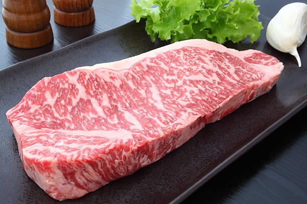
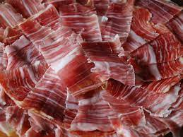
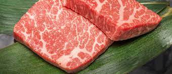

---

---

## MENU 

### Kobe beef 

#### Kobe Beef this happens to be a wagyu beef from the Tajima Strain of Japanese Black cattle, rasied in Japans Hyogo Prefecture around Kobe city. This meat is an absoulte delicacy, which is held in high value for it's flavour, tenderness and marbled texture. 

# Price is $250 for 8oz 

### Jamon lerbrico bellota 

### Jamon lberico bellota. This a cured leg of pork produced from free-range pigs that roam oak forest along the border between Spain and Portugal. Jamon lerberico bellota is know for it's unmatchable quality,flavor and texture. 

# Price is $135 for 12 oz 

### Matsusaka beef is meat from Japanese black cattle reared under strict conditions in the Matsusaka region of Mie in Japan. When it comes to the tates of Matsusaka beef it is very similer to Kobe beef but it's extremely rich due to it's melting point that has about the same temperature as your tounge. 

# Price is $150 for 8oz 
